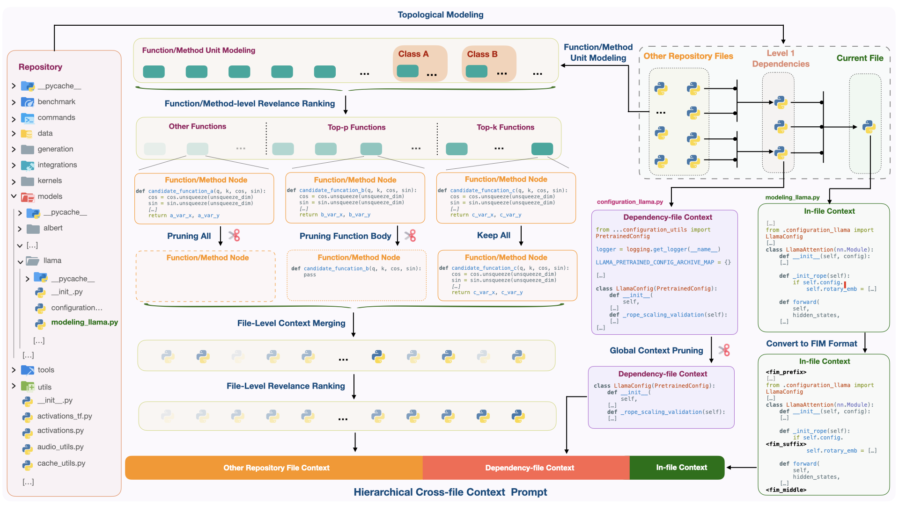

## Hierarchical Context Pruning: Optimizing Real-World Code Completion with Repository-Level Pretrained Code LLMs

<a href='https://arxiv.org/abs/2406.18294'></a>





### Requirements

- Run `pip install -r requirements.txt` to install all requirements.


### Dataset

1. Request the original data:

	We have constructed the test set using the original data from [CrossCodeEval](https://crosscodeeval.github.io). Due to copyright issues, please contact the [author(s)](https://robin-y-ding-columbia.github.io) of CrossCodeEval to request the original data.

2. Construct the test set:

	Run `python utils/preprocess/crosscodeeval.py` will create a jsonl file containing the meta information for the test set.


### Experiments

#### Create Completion Context

The script `python create_completion_metadata.py` will generate different code completion context based on various hyperparameter settings:
  - `--input_file` : The path to data generated by `python utils/preprocess/crosscodeeval.py`;
  - `--output_file`: The path to store completion context information;
  - `--dependency_level`: This parameter is used to control the depth of dependency files. You can select `0`, `1`, `2`, `3`, `4`, or `-1`. A value of `-1` indicates the use of the entire repository's code content;
  - `--info_level`: This parameter represents the level of context information used, corresponding to different degrees of pruning. Valid options include: `dense_cross_dense_infile`, `concise_cross_dense_infile`, `sparse_cross_dense_infile`, `dense_random_cross_dense_infile` and `hierarchical_cross_dense_infile`;
  - `--top_k`: The parameter is used to determine the number of most relevant code units;
  - `--top_p`: The parameter is used to determine the proportion of code units that are relatively relevant.


#### Evaluate Code LLMs

1. The script `python complete.py` will generate completion results accroding to the given completion context:
	- `--model_name_or_path` : The path to model checkponit;
	- `--data_file`: The path to data file generated by `python create_completion_metadata.py`;
	- `--output_file` : The output file to save the completion results;
	- `--truncate`: Wether to truncate the input to the model max length.
2. The script `python evaluate.py` will calculate the **Excatly Mact(EM)** and **Edit Similarity(ES)** metrics:
	- `--input_file`: The path to Code LLM's completion results.


### Citations

If you find our work useful, please cite us.

```
@misc{zhang2024hierarchicalcontextpruningoptimizing,
      title={Hierarchical Context Pruning: Optimizing Real-World Code Completion with Repository-Level Pretrained Code LLMs}, 
      author={Lei Zhang and Yunshui Li and Jiaming Li and Xiaobo Xia and Jiaxi Yang and Run Luo and Minzheng Wang and Longze Chen and Junhao Liu and Min Yang},
      year={2024},
      eprint={2406.18294},
      archivePrefix={arXiv},
      primaryClass={cs.CL},
      url={https://arxiv.org/abs/2406.18294}, 
}
```

